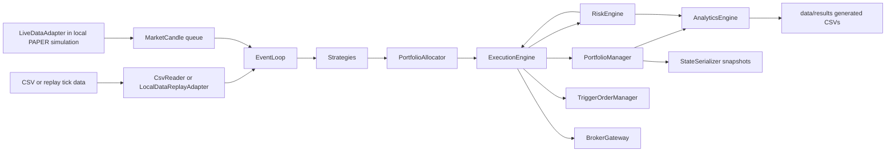

# TradeBot Architecture

## Purpose And Authority

- Purpose: authoritative description of TradeBot system structure, boundaries, data flow, and architectural constraints.
- Authority level: architecture policy below accepted ADRs and risk policy, above active plans.
- Audience: operator, maintainers, Codex, contributors, reviewers, testers, and research agents.

## System Purpose

TradeBot is a C++20 trading-system research and engineering repository with a deterministic core for market-data replay, L2 order book logic, strategy execution, portfolio/risk accounting, trigger orders, analytics, metrics, state serialization, tests, and benchmarks. It has live-capable adapter classes, but live trading is prohibited unless explicitly authorized through the risk and live-readiness gates.

## Project Workstream Map

`WORKSTREAM_ARCHITECTURE.md` defines `TradeBot Workstream Architecture v1.0`, the current project-level Workstreams I-VII domain and coordination map. It organizes planning around broker-neutral foundation, broker integration, documentation, research, platform enhancement, production governance, and strategic alternatives without changing the system boundaries in this document.

The workstream map is a planning/governance artifact only. It does not authorize source implementation, broker connection, external calls, credentials, account actions, sandbox orders, live deployment, or live trading.

## Current Remediation Boundary

`REPOSITORY_REMEDIATION_PROGRAM.md` defines the sole current cross-cutting
implementation focus. It does not alter the intended component map below; it
records that the observed implementation does not yet uphold all of these
boundaries coherently. WP-0 is approved and current; WP-1 is approved and
dependency-queued; WP-2 through WP-8 remain Planned / NO-GO except for
WP-7/WP-8 closure slices integrated into WP-0 and WP-1.

The repository must not advance provider, feature, phase, research,
optimization, or deployment work until package-specific evidence repairs the
containment, persistence, accounting, risk, lifecycle, runtime/data,
transport, CI/observability, and authority gaps. Historical architecture and
ADR decisions remain constraints, not proof that implementation is complete.

## Architectural Principles

- Default to deterministic `BACKTEST` behavior.
- Keep replay, research, execution, risk, broker, analytics, and persistence boundaries explicit.
- Preserve dry-run and paper behavior as the safe default for live-like workflows.
- Keep credentials outside source and documentation.
- Keep generated outputs outside Git unless intentionally versioned.
- Require tests for changed behavior and benchmarks for performance claims.
- Do not promote unverified legacy claims into architecture.

## Verified Components

| Area | Verified files | Responsibility |
| --- | --- | --- |
| Runtime config | `include/SystemConfig.hpp` | `BACKTEST`, `PAPER`, `LIVE` modes; endpoints; credential env names; circuit-breaker thresholds |
| CSV input | `CsvReader` | Candle input for deterministic backtest path |
| Local replay | `LocalDataReplayAdapter` | CSV/binary replay ticks, pacing, generated binary replay writes |
| Order book | `L2OrderBook` | L2 level storage, BBO updates, recentering |
| Strategies | `IStrategy`, `SmaCrossStrategy`, `MeanReversionStrategy` | Signal generation boundary |
| Allocation/regime | `PortfolioAllocator`, `RegimeDetector` | Strategy weights and market-regime classification |
| Portfolio/risk | `PortfolioManager`, `RiskEngine` | Position accounting, drawdown, VaR, circuit breakers, halt state |
| Execution | `ExecutionEngine`, `TriggerOrderManager` | Signal execution, pending/trigger orders, broker routing bridge |
| Live data | `LiveDataAdapter` | Live-like candle queue, simulated external payload/test hooks, reconnect/gap-fill state |
| Broker | `BrokerGateway`, `IBrokerAdapter`, `DeterministicBrokerAdapter`, `OrderLifecycleStore` | Broker-neutral order normalization, lifecycle events, paper-mode deterministic adapter simulation, live-capable broker boundary, reconciliation snapshot |
| Network/auth | `AsyncNetworkClient`, `AuthManager`, `CTraderOAuthCorrelationGuard` | Async network bridge, HMAC signing, env/config credential loading, and offline-only one-shot cTrader OAuth correlation control |
| Analytics/persistence | `AnalyticsEngine`, `MetricsAggregator`, `LocalMetricsExporter`, `StateSerializer` | CSV outputs, latency summaries, local metrics, resume snapshots |
| Tests | `tests/phase13_tests.cpp` through `tests/phase18_tests.cpp` | Phase regression coverage |
| Benchmarks | `src/benchmarks/` | Throughput, Phase 18 burn-in, Phase 19 `applyBbo` microbenchmark |

## Data Flow



## Control Flow

1. `src/main.cpp` parses `--mode` and `--resume`.
2. `SystemConfig` defaults to `BACKTEST`.
3. In `BACKTEST`, file readers drive deterministic candle streams.
4. In `PAPER`, `LiveDataAdapter` and `BrokerGateway` connect to local
   deterministic simulations. The default build rejects `LIVE` before engine,
   credential, or network initialization.
5. Per-symbol strategies and event loops produce signals.
6. `PortfolioAllocator` weighs strategies.
7. `RiskEngine` gates new trading actions.
8. `ExecutionEngine` simulates fills only when no gateway is bound. Once a
   gateway is bound, an unavailable gateway rejects execution rather than
   falling back to a local fill.
9. Analytics and state snapshots write generated outputs.

## Execution Modes

Verified code modes:

- `BACKTEST`: default deterministic CSV-driven path.
- `PAPER`: local live-data-like adapter path with deterministic broker behavior.
- `LIVE`: legacy live-capable market-data path, default-disabled at compile
  time and requiring `--unlock-live-runtime` in addition to a non-default
  build; broker execution remains separately fail-closed.

Architecture policy:

- `BACKTEST` and dry-run behavior are safe defaults.
- `PAPER` must remain simulated locally unless explicitly connected to a sandbox by approved work.
- `LIVE` is technically contained by a default-off build option and an explicit
  runtime flag. Those gates do not replace operator approval, risk review, or
  the readiness checklist.
- Sandbox is a governance concept, not a verified `SystemMode` value.

## Exchange And Broker Boundary

`BrokerGateway` is the broker boundary. It owns broker-neutral order normalization, local-to-external identity correlation, lifecycle event handling, cancellation, reconciliation snapshot handling, paper-mode deterministic adapter simulation, and live-capable broker interaction. `IBrokerAdapter` implementations attach below `BrokerGateway`; provider-native schemas must be translated into broker-neutral lifecycle, execution, cancel, health, account, instrument, and reconciliation contracts before core components consume them. Execution logic must not bypass `BrokerGateway` for live-capable order side effects.

## cTrader Open API Boundary

ADR 0004 makes official cTrader Open API the sole integration path for the FIBO
Group demo-only XAUUSD target. Gate 2 and Gate 5 were accepted by Wade on
2026-08-07 as design evidence only. Gate 5.1 is merged and accepted, and Wade
separately authorized Gate 6. Gates 1-3 pin the official proto2 schema; the
Gate 6 branch adds an opt-in proof target without changing production runtime
modes or broker behavior.

The Gate 6 boundary:

- keep OAuth, Keychain, provider messages, account IDs, and demo transport in a
  cTrader-specific layer below `BrokerGateway`;
- use the fixed loopback callback and Wade-authorized `trading` scope for Gate
  6, while a numeric outbound allowlist prevents every trading, position,
  symbol, market-data, and order message;
- connect only to immutable `demo.ctraderapi.com:5035` using Protobuf over
  strict TLS/TCP with no live/configurable fallback;
- use Gate 6A only to discover response-derived demo candidates and exact broker
  identity while retaining `ctidTraderAccountId` only in volatile process
  memory; present Wade only exact `isLive` and `brokerTitleShort` facts, stop if
  they cannot identify exactly one intended demo account, then allow Gate 6B
  to reproduce that two-field predicate against a fresh list and authenticate
  exactly one match using the fresh ID only in that session's request;
- keep `traderLogin`, account numbers, visible logins, candidate labels,
  per-account ordinals, and equivalent account-identifying values volatile and
  exclude them from logs, evidence, reports, configuration, checkpoints, and
  every persisted selection predicate;
- exclude every live account from candidacy while treating unrelated live
  entries as exclusions rather than global failure;
- preserve exact broker-neutral numeric contracts with integer-only,
  explicitly named rounding and validation policies;
- expose no order-capable message or adapter until a later explicit directive.

The accepted `CTraderOAuthCorrelationGuard` remains independently tested
offline and is now wired only into the opt-in Gate 6 one-shot loopback runtime.
That runtime has fixed authorization/token/demo hosts, an outbound Protobuf
message allowlist limited to application auth, account discovery, account
auth, and heartbeat, macOS Keychain storage, strict TLS, bounded diagnostics,
and a volatile account-proof state machine. It is not attached to a runtime
mode, `BrokerGateway`, market data, or order execution. The controlled provider
callback on 2026-08-10 returned the exact correlation state, establishing that
provider behavior for the registered loopback flow.

The cTrader Algo/cBot Bridge is
`ABANDONED — NON-CONTROLLING — OUT OF SCOPE`. It is not part of this branch's
runtime architecture or evidence base.

### Gate 7 Fresh XAUUSD Proof Boundary

Gate 7 is a separate, default-disabled, macOS-only proof target. It is not a
provider adapter and is not attached to `BrokerGateway`, `LiveDataAdapter`,
`ExecutionEngine`, `RiskEngine`, `SystemConfig`, or any `BACKTEST`, `PAPER`, or
`LIVE` runtime mode. It reuses reviewed transport, framing, OAuth-correlation,
Keychain, and authentication boundaries only where the stricter Gate 7
controls remain intact.

Its fixed outbound allowlist admits only heartbeat, application authentication,
access-token account-list discovery, account authentication, non-archived symbol
list retrieval, full-symbol lookup by a fresh response-derived ID, exactly one
symbol's spot subscription/unsubscription, and required fixed error handling.
Every order, position, depth, trendbar, historical-data, and reconnect payload
is rejected before serialization or socket write. The dispatcher accepts only
the corresponding responses, spot events, heartbeat, and fixed fail-closed
provider errors.

The state machine keeps account and symbol identifiers process-local and fresh.
It requires exactly one present `isLive=false` and exact `brokerTitleShort=FIBO`
account, canonicalizes only `XAUUSD`/`XAU/USD`, validates complete light/full
metadata under the accepted Gate 2 integer contract, and accepts a spot event
only after subscription acknowledgement and current-generation/account/symbol
matching. Provider scale-5 bid/ask values are converted with checked integer
arithmetic. The undocumented timestamp unit is proven only when exactly one of
seconds, milliseconds, microseconds, or nanoseconds meets the bounded freshness
window; otherwise the proof fails closed.

The remaining Gate 7 transport corridor uses Gate-7-only typed outcomes for
send, receive, provider category, correlation, malformed input, disconnect,
token/account invalidation, and resource failure. Only fixed local diagnostic
literals may leave the runtime; raw provider codes, descriptions, retry values,
maintenance timestamps, correlations, identifiers, and payloads are cleared.
The response and spot waits send only the already-allowed heartbeat on a
nine-second monotonic cadence bounded by the original absolute deadline; they
never reconnect or extend the wait.

A well-formed current-generation/account/symbol spot event that omits a side or
timestamp is incomplete, not accepted. Gate 7 retains no side or timestamp from
that event and continues only inside the existing absolute spot deadline. The
first single event containing both positive sides and a timestamp must pass all
raw/normalized crossing, arithmetic, unit, and freshness checks. Wrong
identity, malformed input, invalid prices, crossed markets, and protocol errors
remain immediately terminal.

The initial Gate 7 provider attempt on 2026-08-10 stopped at unresolved
in-process macOS Keychain access. A later generic OAuth failure was followed by
an OAuth-hardened `gate7_oauth_callback_timeout`. The latest authorized process
advanced through OAuth, the fixed demo TLS endpoint, application/account
authentication, canonical XAUUSD resolution, and full metadata validation,
then stopped at `gate7_subscription_failed`. The subscription subcause remains
unclassified; no accepted subscription, quote, or timestamp evidence exists,
and no reconnect occurred.

## Market-Data Boundary

`CsvReader` and `LocalDataReplayAdapter` handle local data. `LiveDataAdapter` handles live-like and live-capable market data. Strategy, portfolio, and risk components should consume normalized candles or replay ticks through explicit interfaces rather than parsing external payloads directly.

## Order-Book Boundary

`L2OrderBook` owns BBO and level-state behavior. Changes to `applyBbo`, recentering, best quote validity, or tick mapping require targeted tests and performance evidence when performance is claimed.

## Replay Boundary

`LocalDataReplayAdapter` owns replay tick loading, binary serialization, pacing modes, and cursor behavior. Replay compatibility changes require `docs/DATA_POLICY.md` review and tests for CSV/binary behavior.

## Strategy Boundary

Strategies emit signals and should not directly mutate portfolio state, bypass risk gates, or access credentials. New research or ML logic must enter through explicit signal, parameter, or configuration interfaces.

## Portfolio And Risk Boundary

`PortfolioManager` owns position and trade accounting. `RiskEngine` owns drawdown, VaR, position limits, halt state, circuit breakers, and live volatility scaling. Execution must consult risk before opening new positions.

## Analytics And Persistence Boundary

`AnalyticsEngine`, `MetricsAggregator`, `LocalMetricsExporter`, and `StateSerializer` write generated results, latency reports, metrics, and snapshots. Generated outputs belong under ignored paths unless intentionally versioned.

## Testing Architecture

CTest registers phase tests:

- `phase13_tests`
- `phase15_tests`
- `phase16_tests`
- `phase17_tests`
- `phase18_tests`
- `phase22_tests`
- `ctrader_gate5_1_tests`

Tests are C++ executables linked against `tradebot_core_lib`. Some tests create temporary files under `/tmp`.

## Benchmark Architecture

Benchmark executables:

- `throughput_bench`
- `phase18_burnin`
- `apply_bbo_microbench`

Benchmark outputs can write generated CSVs under `data/results/` or logs under `build/`. Performance claims require command, environment, input size, result, and comparison basis.

## Configuration Handling

Configuration currently lives in `SystemConfig` and CLI parsing in `src/main.cpp`. Verified CLI flags:

- `--mode backtest|paper|live`
- `--resume <snapshot-file>`

Unrecognized mode strings parse to `BACKTEST`. Credential env fallbacks are `AIIO_API_KEY` and `AIIO_API_SECRET`.

## Credential Boundary

`AuthManager` loads credentials from `SystemConfig` first, then environment variables. Secrets must not be committed, logged, or documented. Documentation may mention env var names but never values.

Future cTrader credentials do not use the generic copying `AuthManager` API.
The client ID is injected by the name `TRADEBOT_CTRADER_CLIENT_ID`; the client
secret and scope-qualified token envelope live in macOS Keychain. Authorization
codes are memory-only. See `CTRADER_OPEN_API_GATE5.md`.

## Extension Points

- New strategies through `IStrategy`.
- Research outputs through structured configuration, replay outputs, or strategy parameter interfaces.
- New tests as CTest executables.
- New benchmarks under `src/benchmarks/` with generated outputs under ignored paths.
- New ADRs for durable architectural decisions.

## Prohibited Coupling

- Strategies must not directly place broker orders.
- Research code must not bypass risk gates.
- Live-capable adapters must not be enabled by default.
- Credential loading must not move into strategy or analytics code.
- Generated results must not become hidden inputs to source behavior without explicit data policy review.
- Performance optimizations must not silently weaken correctness tests or risk behavior.

## Current Architectural Debt

- The WP-0 candidate establishes a default-off compile/runtime gate, rejects
  unauthorized LIVE startup before credentials/network setup, and prevents an
  unavailable bound gateway from creating local fills. Acceptance remains
  pending until its reviewed branch is merged.
- Persistence, generated-state containment, accounting/quantity units, risk
  state, order lifecycle, runtime/data contracts, transport/provider mapping,
  CI/observability, and authority synchronization require WP-1 through WP-8.
- Source comments reference deprecated MOP/workstream labels; ADR 0001 makes those labels historical only.
- `docs/ARCHITECTURE.md` previously referenced `data/historical/` before that path existed in the tracked tree; it is now described as code-referenced, not tracked.
- Build currently emits two warnings.
- No configured formatter, static analyzer, or Markdown link checker was found.
- Live-capable code exists, but live readiness is not established.

## Architecture Validation

Validate architecture-affecting work with:

```sh
cmake -S . -B build
cmake --build build
ctest --test-dir build --output-on-failure
```

Add targeted tests and benchmarks when touching replay, order-book, execution, risk, broker, or performance paths. Update this document and create or update an ADR for durable boundary changes.
