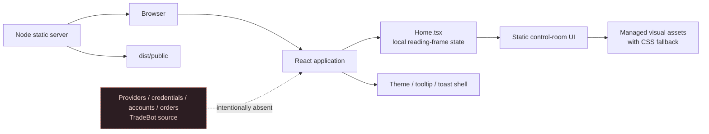

# Mynyra-Trade — Codex Architecture Summary

> Archived 2026-08-30. This pre-engine summary is retained for history and is
> superseded by the root `ARCHITECTURE.md` and the current `engine/` layout.

## Purpose and current authority

Mynyra-Trade is the intended **product-level home** for the broader software system around TradeBot. It is deliberately not a migration of the existing TradeBot source repository. The current repository contains an offline, non-trading control-room website foundation whose job is to make product boundaries, evidence posture, and future ownership legible before any data or execution capability is introduced.[1] [2]

> **Current authority:** Mynyra-Trade may contain static local presentation and product documentation. It may not contact providers, read or represent credentials, access accounts, retrieve market data, create orders, change risk limits, or imply any of those capabilities.[1]

The repository is a Radicle working copy on `main`. At the Codex/Radicle integration evidence epoch, the source has an initial local commit and a Radicle-only upstream; verify the current branch, commit, and Radicle identity before any forge action. This summary describes local repository state, not a published, deployed, or peer-synced system.

| Dimension | Current fact | Implication for Codex |
| --- | --- | --- |
| Product role | Future software-level product home around TradeBot | Do not treat this as a TradeBot checkout or silently import TradeBot source. |
| Runtime mode | Static React frontend with a small static-serving Node entrypoint | No backend route, database, provider client, or real-time data path exists. |
| Operational posture | Offline and non-trading | Preserve absence of credentials, accounts, market data, orders, and risk controls. |
| Forge posture | Radicle-only upstream on `main` | Use local Git for inspection and Radicle for authorized collaboration; do not add GitHub or another centralized forge. |
| Evidence posture | Local UI state and documented verification only | Label future values as observed, inferred, or unavailable; never present synthetic live state as fact. |

## System topology



The browser receives a statically built React application. `Home.tsx` holds the current page composition and its only local interaction state: changing a reading frame and showing explicit non-operational notices. The Node entrypoint only serves the built static files and returns the SPA entry point for client-side routes.[2] [4]

No arrow crosses from the UI to an external provider, a credential store, a financial account, or TradeBot runtime code. That absence is the central architectural decision, not an unfinished implementation detail.

## Repository structure and ownership

| Path | Ownership | Current responsibility | Codex guidance |
| --- | --- | --- | --- |
| `AGENTS.md` | Repository contract | Product boundary, working rules, safety limits, reporting requirements | Read first; it is the operating contract for any change. |
| `README.md` | Repository orientation | Scope, exclusions, local run and verification commands | Keep it aligned with actual capabilities. |
| `ARCHITECTURE.md` | Architecture contract | Static-only topology, ownership boundary, extension seams, non-goals | Update for any durable system or boundary change. |
| `RADICLE.md` | Forge and runtime-placement contract | Radicle-only workflow, Manus provenance, future `asus-node` backend boundary | Read before issue, patch, publish, sync, deployment, or source migration work. |
| `HANDOFF.md` | Execution evidence | Authorized scope, verification, warnings, rollback posture, prohibited actions | Treat it as the continuation record for this foundation. |
| `ideas.md` | Design contract | Night Operations Manual design system and interaction ethos | Follow it before changing composition or visual language. |
| `CODEX_ARCHITECTURE_SUMMARY.md` | Codex integration map | This detailed implementation and governance summary | Start here after `AGENTS.md`; keep it evidence-based. |
| `client/src/App.tsx` | Application shell | Dark theme, error boundary, tooltip/toast providers, Wouter route switch | Keep global composition narrow and route additions explicit. |
| `client/src/pages/Home.tsx` | Product control room | Static content, local panel selection, non-operational notices, section composition | Keep provider-free; separate future data adapters from present UI. |
| `client/src/index.css` | Design system | Tokens, layout, responsive behavior, reduced-motion-aware transitions | Preserve the Night Operations Manual tokens and visible contrast rules. |
| `client/src/components/ui/` | Template primitives | Reusable UI elements from the static template | Prefer existing primitives over new duplicate abstractions. |
| `server/index.ts` | Static-serving compatibility layer | Serves `dist/public` and SPA fallback | It is not an API server; do not add backend behavior without explicit approval. |
| `shared/` | Template compatibility layer | Minimal shared placeholder | Do not infer a data model from its presence. |
| `patches/wouter@3.7.1.patch` | Dependency patch | Captures route paths in a browser global for the template | Preserve exact hunk format; see the patch-format exception below. |

`node_modules/`, `dist/`, and `client/public/__manus__/version.json` are generated or environment-specific paths and remain ignored. They are not source of truth and must not be staged as product source.[1]

## Frontend composition

The application uses React 19, Wouter client-side routing, Tailwind 4, shadcn-style primitives, and Vite. The production build creates browser assets under `dist/public` and a small Node static server bundle. The package scripts are `dev`, `build`, `start`, `check`, and `format`; only the first four are relevant to the current foundation.[4]

### Application shell

`App.tsx` wraps routing in the error boundary, a dark `ThemeProvider`, `TooltipProvider`, and Sonner toast provider. The route table intentionally contains the root control room and a NotFound fallback only. This makes the surface simple to inspect and prevents nested navigation from creating hidden operational areas.

### Control-room page

`Home.tsx` uses a static `panels` record and a local `activePanel` state value. The left rail switches among **Overview**, **System map**, and **Evidence** reading frames; this changes explanatory copy only. `handleFoundationAction` produces a toast stating that the requested function is not connected, rather than simulating a provider or account action.[2]

| UI area | Purpose | State / behavior | Safety meaning |
| --- | --- | --- | --- |
| Instrument rail | Product identity and reading-frame navigation | Local `activePanel` selection | It does not navigate to provider or execution controls. |
| Safety strip | Prominent operating boundary | Static copy | States that credentials, providers, market data, and orders are not present. |
| Hero readout | Current posture | Reads static panel metadata | Describes a product shell, not live system health. |
| Posture ledger | Deliberate absences | Static list of unavailable capabilities | Names provider transport, account state, and execution as absent or prohibited. |
| Ownership / evidence zone | Product transition and evidence language | Static architecture map and evidence list | Keeps TradeBot separate and labels evidence status without inventing data. |
| Handoff band | Continuation discoverability | Static links-by-name and local copy | Directs the next reader to the repository contracts. |

### Visual system and accessibility

The chosen **Night Operations Manual** style combines a midnight ink field, burnished signal copper registration marks, editorial serif display typography, technical monospaced status language, and asymmetric field-desk layout.[5] `index.css` owns the tokens and uses explicit responsive breakpoints at 1020 px and 730 px. The desktop instrument rail becomes a compact horizontal reading-frame strip on small screens. Motion is limited to opacity/transform transitions and is gated behind `prefers-reduced-motion`.[5]

Generated visual assets are referenced through managed `/manus-storage` paths. Each visual image has an `onError` fallback that hides the unavailable image and leaves a CSS field treatment; the interface remains interpretable if a managed asset is unavailable in another environment.[2] Do not replace these assets with provider screenshots, account data, or anything credential-like.

## Data, integration, and execution boundaries

There is no runtime data model beyond local display state. The evidence register is a copy and layout concept; it does not fetch, retain, transform, or validate external information. Consequently, there is also no authentication, provider SDK, HTTP API call, database schema, secret injection, order lifecycle, or risk-control logic.[1] [3]

Any future integration must begin with a new reviewed plan that names the data source, evidence provenance, display classification, failure state, retention boundary, verification command, rollback path, and exact operator authorization. A future read-only evidence adapter does not imply authority to add credentials, account access, provider traffic, orders, paper trading, or live trading.[3]

```text
Allowed now:
  Static local presentation → local React state → explicit unavailable notices

Requires separate plan and exact authorization:
  Evidence source → provenance validation → read-only display model

Prohibited absent new authority:
  Credentials → provider traffic → account data → orders → risk changes → live use
```

## Build, verification, and evidence epoch

The following are historical verification results from the initial Manus-source foundation. They are useful provenance, but not a claim about the current worktree; re-run the relevant checks before any source, packaging, or deployment decision:

| Verification | Result | Notes |
| --- | --- | --- |
| Dependency install | Passed | Lockfile was current; the required Wouter patch applied successfully. |
| Type check | Passed | `tsc --noEmit`. |
| Production build | Passed | Vite built the browser bundle and esbuild created the static server bundle. |
| Offline dependency reinstall | Passed | Validates the restored Wouter patch from the local cache. |
| Desktop visual review | Completed | Reviewed at 1440 × 1100 in the prepared project. |
| Mobile visual review | Completed | Reviewed at 390 × 844 in the prepared project. |
| Staged source count | 87 files | Initial repository; all source/documentation/configuration files are staged. |
| Unstaged source count | 0 files | Generated outputs remain ignored. |

The build currently emits non-failing warnings. pnpm reports that native build scripts for `@tailwindcss/oxide` and `esbuild` are not approved. Node 26 reports a `module.register()` deprecation. Vite also reports unresolved optional analytics placeholders in `client/index.html` and a non-module analytics script reference. The site still builds, but analytics must be removed, configured, or safely guarded before production-oriented work.[3]

## Wouter patch formatting exception

The initial source review reported three `git diff --cached --check` findings in `patches/wouter@3.7.1.patch`: two whitespace-only hunk-context lines and the final hunk-context blank line. These are formatting markers inside the unified diff, not trailing whitespace in the generated application source.

An attempted blanket trim made pnpm reject the patch with `ERR_PNPM_INVALID_PATCH` because it changed the hunk old-side line count. The valid patch was restored and its application was verified with an offline pnpm install. Codex should therefore treat this as a **narrow, verified patch-format exception**, not as permission to waive whitespace checks elsewhere. If a fully clean `git diff --cached --check` is mandatory, regenerate an equivalent patch against the exact Wouter package under separately explicit approval, then update the lockfile hash and rerun all verification.

## Codex continuation protocol

Codex should begin with repository evidence, not the UI alone. Read `AGENTS.md`, `README.md`, `ARCHITECTURE.md`, `RADICLE.md`, `HANDOFF.md`, `ideas.md`, and this summary. Then inspect `git status`, any staged index, the Radicle project/node state, and the exact package patch. Do not create a commit merely because source is staged or a Radicle node is healthy.

| Proposed Codex action | Present authority | Required condition |
| --- | --- | --- |
| Review architecture and source | Allowed | Preserve current boundaries and distinguish facts from assumptions. |
| Normalize ordinary source whitespace | Allowed if scoped | Exclude the verified Wouter patch-format exception unless a replacement patch is approved. |
| Change UI composition or copy | Needs scoped review | Keep it static, evidence-aware, and non-operational. Update `ideas.md` or architecture docs if the decision is durable. |
| Add a data adapter | Not authorized | Obtain a reviewed evidence/provenance plan and exact operator authorization. |
| Add backend, database, auth, or secrets | Not authorized | Obtain a distinct architecture and implementation authorization. |
| Import TradeBot code or documents | Not authorized | Obtain a dedicated migration plan that explicitly lists source and evidence boundaries. |
| Create or operate a backend on `asus-node` | Not authorized | Obtain an asus-node deployment plan with service, network, secrets, observability, rollback, and operator authority. |
| Commit, push, publish, deploy, or create a PR | Not authorized | Obtain explicit Git/publication authorization. |
| Radicle issue, patch, publish, sync, seed, or follow-policy change | Not authorized by this foundation | Use `RADICLE.md`; persistent collaboration and network effects require explicit authorization. |
| GitHub remote, workflow, issue, PR, release, or `gh` command | Prohibited | Radicle is the repository's sole forge. |
| Provider traffic, account access, orders, or risk changes | Prohibited | Requires a separate safety and operator authorization path. |

The immediate safe next action is a Codex review of the staged diff against this summary and the existing handoff documents. The next implementation action should be selected only after the operator names a narrow product capability and its evidence boundary.

## References

[1]: [Repository operating contract (`AGENTS.md`)](./AGENTS.md)
[2]: [Current control-room implementation (`client/src/pages/Home.tsx`)](./client/src/pages/Home.tsx)
[3]: [Architecture and handoff contracts (`ARCHITECTURE.md`, `HANDOFF.md`)](./ARCHITECTURE.md)
[4]: [Build/runtime configuration (`package.json`, `server/index.ts`)](./package.json)
[5]: [Visual design contract (`ideas.md`) and stylesheet (`client/src/index.css`)](./ideas.md)
