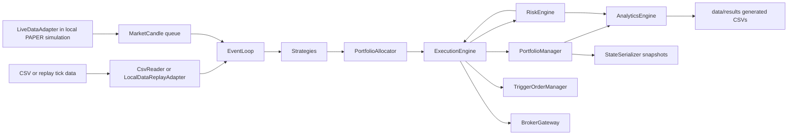

# Mynyra Engine Architecture

## Purpose And Authority

- Purpose: authoritative description of TradeBot system structure, boundaries, data flow, and architectural constraints.
- Authority level: architecture policy below accepted ADRs and risk policy, above active plans.
- Audience: operator, maintainers, Codex, contributors, reviewers, testers, and research agents.

## System Purpose

Mynyra Engine is an imported C++20 trading-system source lineage with a deterministic core for market-data replay, L2 order book logic, strategy execution, portfolio/risk accounting, trigger orders, analytics, metrics, state serialization, tests, and benchmarks. It has live-capable adapter classes, but the current cutover permits only the provider-free offline replay described in `MYNYRA_OFFLINE_REPLAY.md`.

## Project Workstream Map

`WORKSTREAM_ARCHITECTURE.md` defines `TradeBot Workstream Architecture v1.0`, the current project-level Workstreams I-VII domain and coordination map. It organizes planning around broker-neutral foundation, broker integration, documentation, research, platform enhancement, production governance, and strategic alternatives without changing the system boundaries in this document.

The workstream map is a planning/governance artifact only. It does not authorize source implementation, broker connection, external calls, credentials, account actions, sandbox orders, live deployment, or live trading.

## Current Remediation Boundary

`REPOSITORY_REMEDIATION_PROGRAM.md` defines the sole current cross-cutting
implementation focus. It does not alter the intended component map below; it
records that the observed implementation does not yet uphold all of these
boundaries coherently. WP-0 and WP-1 are merged and accepted. WP-2 has an
authorized local candidate awaiting review and acceptance; WP-3 through WP-8
remain Planned / NO-GO except for package-integrated WP-7/WP-8 closure slices.

The repository must not advance provider, feature, phase, research,
optimization, or deployment work until package-specific evidence repairs the
containment, persistence, accounting, risk, lifecycle, runtime/data,
transport, CI/observability, and authority gaps. Historical architecture and
ADR decisions remain constraints, not proof that implementation is complete.

`PLAN-20260824-mynyra-demo-m1` is the explicit operator-authorized exception:
it maps one default-off, Demo-only XAUUSD commissioning slice to WP-5 through
WP-8. It does not authorize live support, configurable sizing, a second entry,
publication, or deployment. The candidate remains incomplete until the
external process reaches final flat reconciliation and emits
`mynyra_demo_m1_succeeded`.

## Architectural Principles

- Default to deterministic `BACKTEST` behavior.
- Keep replay, research, execution, risk, broker, analytics, and persistence boundaries explicit.
- Preserve dry-run and paper behavior as the safe default for live-like workflows.
- Keep credentials outside source and documentation.
- Keep generated outputs outside Git unless intentionally versioned.
- Require tests for changed behavior and benchmarks for performance claims.
- Do not promote unverified legacy claims into architecture.

## Verified Components

| Area | Verified files | Responsibility |
| --- | --- | --- |
| Runtime config | `include/SystemConfig.hpp` | `BACKTEST`, `PAPER`, default-off cTrader `DEMO`, and contained legacy `LIVE` modes; endpoints; credential env names; circuit-breaker thresholds |
| Offline common ground | `include/MynyraOfflineRun.hpp`, `src/MynyraOfflineRun.cpp` | Hash-pinned `BACKTEST` manifest, redacted evidence, separate capability report, in-process replay limits, deterministic result, and no provider/order authority |
| Financial values | `FinancialMath` | Canonical scale-8 price, quantity, money, rate, checked arithmetic, and rounding contract |
| CSV input | `CsvReader` | Candle input for deterministic backtest path |
| Local replay | `LocalDataReplayAdapter` | CSV/binary replay ticks, pacing, generated binary replay writes |
| Order book | `L2OrderBook` | L2 level storage, BBO updates, recentering |
| Strategies | `IStrategy`, `SmaCrossStrategy`, `MeanReversionStrategy`, `StrategyPipeline` | Signal generation and side-effect-free ensemble evaluation |
| Allocation/regime | `PortfolioAllocator`, `RegimeDetector` | Strategy weights and market-regime classification |
| Portfolio/risk | `PortfolioManager`, `IPortfolioView`, `BrokerPortfolioMirror`, `RiskEngine` | Local spot-cash accounting, read-only economic view, Demo broker-authoritative CFD mirror, drawdown, margin, freshness, exposure, circuit breakers, and halt state |
| Execution | `ExecutionEngine`, `MynyraDemoCommissioningController`, `TriggerOrderManager` | Signal execution, one-shot Demo lifecycle control, pending/trigger orders, and broker routing bridge |
| Live data | `LiveDataAdapter` | Live-like candle queue, simulated external payload/test hooks, reconnect/gap-fill state; no credential ownership or provider-specific REST requests |
| Broker | `BrokerGateway`, `IBrokerAdapter`, `DeterministicBrokerAdapter`, `OrderLifecycleStore`, cTrader Demo adapter | Broker-neutral exact intents, lifecycle events, paper-mode deterministic simulation, default-off Demo provider boundary, and reconciliation snapshots |
| Network/auth | `AsyncNetworkClient`, `AuthManager`, `CTraderOAuthCorrelationGuard` | Async network bridge, HMAC signing, env/config credential loading, and offline-only one-shot cTrader OAuth correlation control |
| Analytics/persistence | `AnalyticsEngine`, `MetricsAggregator`, `LocalMetricsExporter`, `StateSerializer`, `IEventSink` | CSV outputs, latency summaries, local metrics, resume snapshots, and versioned console/NDJSON lifecycle evidence |
| Tests | `tests/phase13_tests.cpp` through `tests/phase18_tests.cpp` | Phase regression coverage |
| Benchmarks | `src/benchmarks/` | Throughput, Phase 18 burn-in, Phase 19 `applyBbo` microbenchmark |

## Data Flow



## Control Flow

1. `src/main.cpp` parses `--mode` and `--resume`.
2. `SystemConfig` defaults to `BACKTEST`.
3. In `BACKTEST`, file readers drive deterministic candle streams.
4. In `PAPER`, `LiveDataAdapter` and `BrokerGateway` connect to local
   deterministic simulations. The default build rejects `DEMO` and `LIVE`
   before credential or network initialization.
5. Per-symbol strategies and event loops produce signals.
6. `PortfolioAllocator` weighs strategies.
7. `RiskEngine` produces the authoritative `RiskDecision` for each order;
   `ExecutionEngine` passes that decision unchanged to `BrokerGateway`.
8. `ExecutionEngine` simulates fills only when no gateway is bound. Once a
   gateway is bound, an unavailable gateway rejects execution rather than
   falling back to a local fill. Confirmed execution events are fully
   validated before execution context or portfolio state advances.
9. Analytics writes generated outputs. BACKTEST checkpoints write canonical,
   checksummed version-13 snapshots by atomic replacement; accounting fields
   are signed scale-8 integer units, and any checkpoint failure stops
   processing.

The default-off DEMO control flow is separate: provider-normalized completed
M1 candles advance `StrategyPipeline`; the one-shot controller converts the
first eligible decision into an exact minimum-volume `OrderIntent`; the normal
execution/risk/gateway path submits it; validated lifecycle events and
authoritative reconciliation update `BrokerPortfolioMirror`; and a native
position close must reconcile the whole account flat before success.

## Execution Modes

Verified code modes:

- `BACKTEST`: default deterministic CSV-driven path.
- `PAPER`: local live-data-like adapter path with deterministic broker behavior.
- `DEMO`: default-off cTrader Demo-only XAUUSD/M1 runtime. It is read-only
  unless `--commission-demo-order` is present and has no live endpoint or
  live-account path.
- `LIVE`: legacy live-capable market-data path, default-disabled at compile
  time and requiring `--unlock-live-runtime` in addition to a non-default
  build; broker execution remains separately fail-closed.

Architecture policy:

- `BACKTEST` and dry-run behavior are safe defaults.
- `PAPER` must remain simulated locally unless explicitly connected to a sandbox by approved work.
- `DEMO` requires `TRADEBOT_ENABLE_CTRADER_DEMO=ON`; this compile-time gate
  does not by itself authorize credentials, provider traffic, or an order.
- `LIVE` is technically contained by a default-off build option and an explicit
  runtime flag. Those gates do not replace operator approval, risk review, or
  the readiness checklist.
- Sandbox is a governance concept, not a verified `SystemMode` value.

### Mynyra Demo M1 Boundary

The candidate implements ADR 0006 as a default-off provider composition below
`BrokerGateway`:

```text
completed cTrader M1 candle
  -> StrategyPipeline
  -> MynyraDemoCommissioningController
  -> ExecutionEngine
  -> RiskEngine (authoritative exact-quantity decision)
  -> BrokerGateway
  -> cTrader Demo IBrokerAdapter
  -> validated execution events + authoritative reconciliation
  -> BrokerPortfolioMirror
  -> native position close
  -> account-wide flat reconciliation
```

Historical warmup changes strategy state but is execution-ineligible. Arming
requires 100 distinct completed historical bars, one completed live M1 bar,
both current BBO sides no older than five seconds, a complete instrument, and
same-generation empty-account reconciliation. DEMO selects exactly one FIBO
account with explicitly present `isLive=false`; missing or true live status,
multiple matches, pending orders, positions, unsupported account types, or
limited-risk status fail closed.

The runtime submits at most one entry, for exactly the provider minimum volume
aligned to its step. It never resubmits an ambiguous entry. After an entry
fill, it requires the broker position side and quantity to match the validated
local lifecycle, then closes that logical position using
`ProtoOAClosePositionReq`. One residual close is allowed only after
reconciliation proves an exact residual quantity and no pending close. A
locally complete close followed by broker residual exposure is recovery-only,
even if one safety close flattens it. Unknown or mismatched exposure emits
`mynyra_demo_recovery_required`, never success.

Transport ownership is confined to one I/O thread with bounded queues,
correlation, incremental frame decoding, ten-second heartbeats, documented
rate limits, and at most two bounded in-process reconnect/reconcile attempts.
The module contains only `demo.ctraderapi.com:5035`. Process-crash recovery is
not implemented; a later run refuses to arm against a non-empty account.

Subscription failures retain the failing safe leg (`spots` or `live_m1`) and a
fixed transport/protocol failure class. This distinction crosses the provider
boundary only as redacted diagnostics; native response text, identifiers, and
payloads remain provider-private.
Valid asynchronous spot events are normalized while another correlated
response is pending. If their local validation fails, the spot-specific fixed
cause is preserved rather than being relabelled as an ordering failure.
Live trendbar open/close/high deltas that are absent use their Protobuf numeric
default of zero; they are not filled from earlier or local market values. Low
and timestamp must remain present, and arithmetic overflow plus OHLC invariants
remain fail-closed.

The current macOS Keychain read uses synchronous `SecItemCopyMatching`. If the
Security framework waits for operator authorization, the outer startup future
can report its bounded timeout but cannot cancel or join that blocked call.
This is a known local teardown limitation until the authorization prompt is
completed or the Keychain boundary gains an explicit noninteractive contract.

## Mynyra Offline Replay Boundary

`MynyraOfflineRunnerV1` is the first deployment-independent engine proof. It receives bytes and a `RunManifestV1` from its caller; it does not open a path or own persistence or transport. It verifies artifact, input, and configuration SHA-256 values; rejects every non-`BACKTEST`, provider-enabled, or order-enabled manifest; advances `StrategyPipeline` with execution ineligible; and returns a redacted `EvidenceEnvelopeV1` plus an explicit `CapabilityReportV1`.

The runner may call `IEventSink`, but a failing sink produces `EvidenceIncomplete`, never a successful result. Node Control, SSH, containers, networking, credentials, broker transport, order dispatch, and risk authority are intentionally outside this interface.

## Exchange And Broker Boundary

`BrokerGateway` is the broker boundary. It owns broker-neutral order normalization, local-to-external identity correlation, lifecycle event handling, cancellation, reconciliation snapshot handling, paper-mode deterministic adapter simulation, and live-capable broker interaction. `IBrokerAdapter` implementations attach below `BrokerGateway`; provider-native schemas must be translated into broker-neutral lifecycle, execution, cancel, health, account, instrument, and reconciliation contracts before core components consume them. Execution logic must not bypass `BrokerGateway` for live-capable order side effects.

## cTrader Open API Boundary

ADR 0004 makes official cTrader Open API the sole integration path for the FIBO
Group demo-only XAUUSD target. Gate 2 and Gate 5 were accepted by Wade on
2026-08-07 as design evidence only. Gate 5.1 is merged and accepted, and Wade
separately authorized Gate 6. Gates 1-3 pin the official proto2 schema; the
Gate 6 branch adds an opt-in proof target without changing production runtime
modes or broker behavior.

The Gate 6 boundary:

- keep OAuth, Keychain, provider messages, account IDs, and demo transport in a
  cTrader-specific layer below `BrokerGateway`;
- use the fixed loopback callback and Wade-authorized `trading` scope for Gate
  6, while a numeric outbound allowlist prevents every trading, position,
  symbol, market-data, and order message;
- connect only to immutable `demo.ctraderapi.com:5035` using Protobuf over
  strict TLS/TCP with no live/configurable fallback;
- use Gate 6A only to discover response-derived demo candidates and exact broker
  identity while retaining `ctidTraderAccountId` only in volatile process
  memory; present Wade only exact `isLive` and `brokerTitleShort` facts, stop if
  they cannot identify exactly one intended demo account, then allow Gate 6B
  to reproduce that two-field predicate against a fresh list and authenticate
  exactly one match using the fresh ID only in that session's request;
- keep `traderLogin`, account numbers, visible logins, candidate labels,
  per-account ordinals, and equivalent account-identifying values volatile and
  exclude them from logs, evidence, reports, configuration, checkpoints, and
  every persisted selection predicate;
- exclude every live account from candidacy while treating unrelated live
  entries as exclusions rather than global failure;
- preserve exact broker-neutral numeric contracts with integer-only,
  explicitly named rounding and validation policies;
- expose no order-capable message or adapter until a later explicit directive.

The accepted `CTraderOAuthCorrelationGuard` remains independently tested
offline and is now wired only into the opt-in Gate 6 one-shot loopback runtime.
That runtime has fixed authorization/token/demo hosts, an outbound Protobuf
message allowlist limited to application auth, account discovery, account
auth, and heartbeat, macOS Keychain storage, strict TLS, bounded diagnostics,
and a volatile account-proof state machine. It is not attached to a runtime
mode, `BrokerGateway`, market data, or order execution. The controlled provider
callback on 2026-08-10 returned the exact correlation state, establishing that
provider behavior for the registered loopback flow.

The cTrader Algo/cBot Bridge is
`ABANDONED — NON-CONTROLLING — OUT OF SCOPE`. It is not part of this branch's
runtime architecture or evidence base.

### Gate 7 Fresh XAUUSD Proof Boundary

Gate 7 is a separate, default-disabled, macOS-only proof target. It is not a
provider adapter and is not attached to `BrokerGateway`, `LiveDataAdapter`,
`ExecutionEngine`, `RiskEngine`, `SystemConfig`, or any `BACKTEST`, `PAPER`, or
`LIVE` runtime mode. It reuses reviewed transport, framing, OAuth-correlation,
Keychain, and authentication boundaries only where the stricter Gate 7
controls remain intact.

Its fixed outbound allowlist admits only heartbeat, application authentication,
access-token account-list discovery, account authentication, non-archived symbol
list retrieval, full-symbol lookup by a fresh response-derived ID, exactly one
symbol's spot subscription/unsubscription, and required fixed error handling.
Every order, position, depth, trendbar, historical-data, and reconnect payload
is rejected before serialization or socket write. The dispatcher accepts only
the corresponding responses, spot events, heartbeat, and fixed fail-closed
provider errors.

The state machine keeps account and symbol identifiers process-local and fresh.
It requires exactly one present `isLive=false` and exact `brokerTitleShort=FIBO`
account, canonicalizes only `XAUUSD`/`XAU/USD`, validates complete light/full
metadata under the accepted Gate 2 integer contract, and accepts a spot event
only after subscription acknowledgement and current-generation/account/symbol
matching. Provider scale-5 bid/ask values are converted with checked integer
arithmetic. The undocumented timestamp unit is proven only when exactly one of
seconds, milliseconds, microseconds, or nanoseconds meets the bounded freshness
window; otherwise the proof fails closed.

The remaining Gate 7 transport corridor uses Gate-7-only typed outcomes for
send, receive, provider category, correlation, malformed input, disconnect,
token/account invalidation, and resource failure. Only fixed local diagnostic
literals may leave the runtime; raw provider codes, descriptions, retry values,
maintenance timestamps, correlations, identifiers, and payloads are cleared.
The response and spot waits send only the already-allowed heartbeat on a
nine-second monotonic cadence bounded by the original absolute deadline; they
never reconnect or extend the wait.

A well-formed current-generation/account/symbol spot event that omits a side or
timestamp is incomplete, not accepted. Gate 7 retains no side or timestamp from
that event and continues only inside the existing absolute spot deadline. The
first single event containing both positive sides and a timestamp must pass all
raw/normalized crossing, arithmetic, unit, and freshness checks. Wrong
identity, malformed input, invalid prices, crossed markets, and protocol errors
remain immediately terminal.

The initial Gate 7 provider attempt on 2026-08-10 stopped at unresolved
in-process macOS Keychain access. A later generic OAuth failure was followed by
an OAuth-hardened `gate7_oauth_callback_timeout`. The latest authorized process
advanced through OAuth, the fixed demo TLS endpoint, application/account
authentication, canonical XAUUSD resolution, and full metadata validation,
then stopped at `gate7_subscription_failed`. The subscription subcause remains
unclassified; no accepted subscription, quote, or timestamp evidence exists,
and no reconnect occurred.

## Market-Data Boundary

`CsvReader` and `LocalDataReplayAdapter` handle local data. `LiveDataAdapter` handles live-like and live-capable market data. Strategy, portfolio, and risk components should consume normalized candles or replay ticks through explicit interfaces rather than parsing external payloads directly.

## Order-Book Boundary

`L2OrderBook` owns BBO and level-state behavior. Changes to `applyBbo`, recentering, best quote validity, or tick mapping require targeted tests and performance evidence when performance is claimed.

## Replay Boundary

`LocalDataReplayAdapter` owns replay tick loading, binary serialization, pacing modes, and cursor behavior. Replay compatibility changes require `docs/DATA_POLICY.md` review and tests for CSV/binary behavior.

## Strategy Boundary

Strategies emit signals and should not directly mutate portfolio state, bypass risk gates, or access credentials. New research or ML logic must enter through explicit signal, parameter, or configuration interfaces.

## Portfolio And Risk Boundary

`PortfolioManager` owns BACKTEST/PAPER position and trade accounting. The WP-2 candidate uses
`Financial::Price`, `Quantity`, `Money`, and `Fraction` at scale 8 for internal
accounting. Buys debit notional plus fee; sells credit notional minus fee;
partial reductions allocate cost basis and entry fees proportionally; and each
position retains its latest mark. Unsupported short reversal or over-close
fails before mutation. Public compatibility getters remain `double` conversion
boundaries. DEMO deliberately does not represent leveraged CFD fills in that
spot-cash ledger. `BrokerPortfolioMirror` advances only from validated
execution events and complete authoritative reconciliation and exposes state
through `IPortfolioView`. `RiskEngine` owns drawdown, VaR, position limits,
halt state, circuit breakers, live volatility scaling, and DEMO checks over
exact quantity, direction-bound expected margin, direction-specific BBO
reference price, BBO/account/reconciliation freshness, account emptiness, and
instrument direction support. Execution must consult risk before opening new
positions; risk-reducing reconciled closes remain possible under
halt/close-only states. No existing risk-limit value is widened.

## Analytics And Persistence Boundary

`AnalyticsEngine`, `MetricsAggregator`, `LocalMetricsExporter`, and
`StateSerializer` write generated results, latency reports, metrics, and
snapshots. `StateSerializer` owns a complete BACKTEST restart contract for
portfolio/accounting, pending-order identity, risk, regime, and allocation
state. Version 13 persists accounting financial fields as signed scale-8
integer units and rejects earlier versions rather than reinterpreting them. It
validates into detached state before a single commit to the runtime
objects. PAPER/DEMO/LIVE resume remains fail-closed; M1 has no process-crash
recovery. DEMO writes versioned redacted events to console and
`output/mynyra-demo/<session-id>.ndjson` through `IEventSink`, flushing
lifecycle boundaries. Provider account/order/position IDs, tokens, URLs, and
raw provider errors are excluded. A later SQLite sink can implement the same
interface. PAPER/LIVE resume remains fail-closed until WP-4 supplies a unified,
reconcilable broker lifecycle. The runtime CLI opens only the governed
`data/results/snapshot.json` restart path; direct serializer callers remain
responsible for supplying trusted paths. Generated outputs belong under exact
ignored directories unless intentionally versioned.

## Testing Architecture

CTest registers phase tests:

- `phase13_tests`
- `phase15_tests`
- `phase16_tests`
- `phase17_tests`
- `phase18_tests`
- `phase22_tests`
- `ctrader_gate5_1_tests`
- `ctrader_provider_architecture_tests`
- `mynyra_demo_core_tests`
- `mynyra_demo_cli_containment`
- `mynyra_offline_run_tests`

The DEMO-enabled build additionally registers frame-decoder, market-state, and
provider-private tests. All are synthetic and perform no provider traffic.

Tests are C++ executables linked against `tradebot_core_lib`. Some tests create temporary files under `/tmp`.

## Benchmark Architecture

Benchmark executables:

- `throughput_bench`
- `phase18_burnin`
- `apply_bbo_microbench`

Benchmark outputs can write generated CSVs under `data/results/` or logs under `build/`. Performance claims require command, environment, input size, result, and comparison basis.

## Configuration Handling

Configuration currently lives in `SystemConfig` and CLI parsing in `src/main.cpp`. Verified CLI flags:

- `--mode backtest|paper|demo|live`
- `--resume data/results/snapshot.json`
- `--provider ctrader --symbol XAUUSD --timeframe M1`
- `--commission-demo-order`
- `--fresh-oauth`

Unrecognized mode strings are rejected. DEMO rejects CSV input, resume,
endpoint/account/volume overrides, and unsupported provider/symbol/timeframe
values. Credential env fallbacks for legacy components are `AIIO_API_KEY` and
`AIIO_API_SECRET`.

## Credential Boundary

`AuthManager` loads credentials from `SystemConfig` first, then environment variables. Secrets must not be committed, logged, or documented. Documentation may mention env var names but never values.

M1 cTrader credentials do not use the generic copying `AuthManager` API.
The client ID is injected by the name `TRADEBOT_CTRADER_CLIENT_ID`; the client
secret and scope-qualified token envelope live in macOS Keychain. Authorization
codes are memory-only. Normal startup uses a valid token or one refresh and
never silently opens a browser. `--fresh-oauth` is the only browser path and
atomically replaces the trading-scope Keychain envelope after validation. No
credential file or encoded copy is parsed. See `SECURITY.md`.

## Extension Points

- New strategies through `IStrategy`.
- Research outputs through structured configuration, replay outputs, or strategy parameter interfaces.
- New tests as CTest executables.
- New benchmarks under `src/benchmarks/` with generated outputs under ignored paths.
- New ADRs for durable architectural decisions.

## Prohibited Coupling

- Strategies must not directly place broker orders.
- Research code must not bypass risk gates.
- Live-capable adapters must not be enabled by default.
- Credential loading must not move into strategy or analytics code.
- `LiveDataAdapter` must not load credentials or construct provider-specific
  REST requests; those belong below a separately approved provider-adapter
  boundary.
- Generated results must not become hidden inputs to source behavior without explicit data policy review.
- Performance optimizations must not silently weaken correctness tests or risk behavior.

## Current Architectural Debt

- WP-0 and WP-1 are merged and accepted. WP-2 has an authorized local
  fixed-scale accounting candidate; review and operator acceptance remain
  pending.
- Risk state, order lifecycle, runtime/data contracts, transport/provider
  mapping, CI/observability, and final authority synchronization require WP-3
  through WP-8.
- Source comments reference deprecated MOP/workstream labels; ADR 0001 makes those labels historical only.
- `docs/ARCHITECTURE.md` previously referenced `data/historical/` before that path existed in the tracked tree; it is now described as code-referenced, not tracked.
- Build currently emits two warnings.
- No configured formatter, static analyzer, or Markdown link checker was found.
- Live-capable code exists, but live readiness is not established.
- The Mynyra Demo M1 candidate has offline evidence only until the three
  external acceptance stages finish. SQLite/process-crash recovery and a
  transport-level fake cTrader server remain deferred proof gaps. M1 currently
  keeps the provider-private protocol operations behind one ordered
  `CTraderSession` translation unit that reuses the audited Gate 7 primitives;
  splitting those operations into the separately compiled service files from
  the target architecture remains a systematic-design follow-up.

## Architecture Validation

Validate architecture-affecting work with:

```sh
cmake -S . -B build
cmake --build build
ctest --test-dir build --output-on-failure
```

Add targeted tests and benchmarks when touching replay, order-book, execution, risk, broker, or performance paths. Update this document and create or update an ADR for durable boundary changes.
